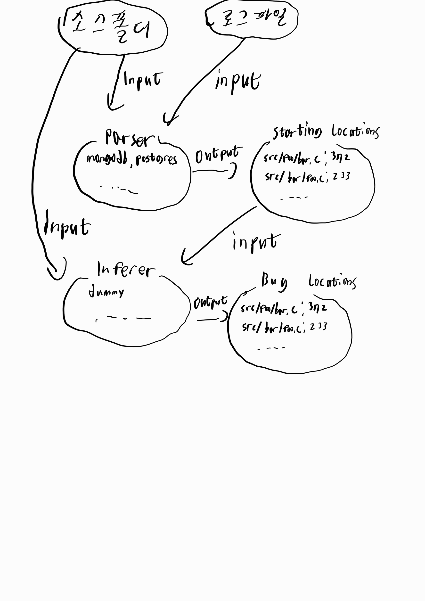

# lets-analyze-logs

조사한 로그들을 이용해 버그의 위치를 찾아내는 프로그램입니다.

현재 개발중인 초기 상태입니다.

가장 쉽고 명백한 케이스 몇개만을 지원합니다.

# 구조



## Starting Location

로그를 분석하여 얻어낸 코드 상의 위치입니다.


## Bug Location

최종적으로 구한 버그의 위치입니다.

각 위치 마다 신뢰도가 평가되어 여러 위치가 나와도 가장 신뢰도가 있는 버그의 위치를 판단할 수 있도록 하면 좋겠지만 현재는 구현되지 않았습니다.

## Parser

여러가지 종류의 로그 형식을 해석하고 인식된 Starting Location을 추출합니다. 

현재는 mongdb와 postgresql의 로그 형식을 제한적으로 지원합니다.

현재는 PANIC이나 FATAL과 같은 로그에서 제공하는 파일과 라인 번호를 그대로 추출하고 있습니다. 

추후 다른 방법이 구현될 예정입니다.

## Inferer

입력된 Starting Location과 소스 폴더를 토대로 더 가치있는 버그위치를 찾기위한 추론을 진행합니다.

현재는 Starting Location 을 Bug Locations으로 그대로 넘기는 dummy만이 구현되어 있습니다. 

# 실행 조건

```shell
# rust 설치
https://rust-lang.org/tools/install/
# 혹은
nix develop

RUST_LOG=DEBUG cargo run -- \<로그 파일의 경로\> \<소스 폴더 경로 \(로그를 출력한 프로그램의 버전과 정확히 일치\)\> \[-g \<Bug Location의 위아래로 표시할 라인의 수\>\]
```

# 테스트

## mongodb

### [SERVER-77168](https://github.com/CLOUDIS-log-analysis/lets-reproduce-logs/tree/main/mongodb/SERVER-77168)

```shell
cd ./tests
wget https://github.com/mongodb/mongo/archive/refs/tags/r6.0.1.tar.gz && tar -xvf r6.0.1.tar.gz
git clone https://github.com/CLOUDIS-log-analysis/lets-reproduce-logs.git
cd ..
RUST_LOG=DEBUG cargo run -- tests/lets-reproduce-logs/mongodb/SERVER-77168/expected-log tests/mongo-r6.0.1
```

## postgresql

### [pg-20191119-fsync-panic](https://github.com/CLOUDIS-log-analysis/lets-reproduce-logs/tree/main/postgresql/pg-20191119-fsync-panic)

```shell
cd ./tests
wget https://ftp.postgresql.org/pub/source/v12.1/postgresql-12.1.tar.gz && tar -xzf postgresql-12.1.tar.gz
git clone https://github.com/CLOUDIS-log-analysis/lets-reproduce-logs.git
cd ..
RUST_LOG=DEBUG cargo run -- tests/lets-reproduce-logs/postgresql/pg-20191119-fsync-panic/logs/result.log tests/postgresql-12.1
```
